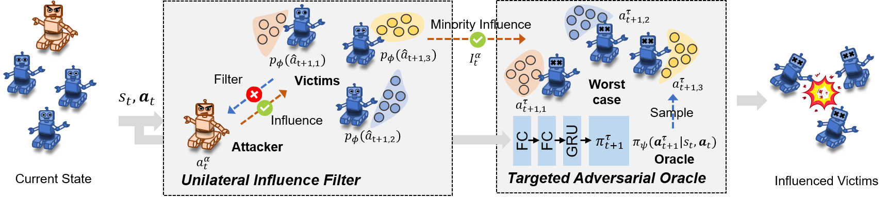

# Attacking Cooperative Multi-Agent Reinforcement Learning by Adversarial Minority Influence

This paper proposed **Adversarial Minority Influence (AMI)**, the first practical black-box adversarial policy attack against c-MARL. Technically, the adversary achieves strong attack capability by taking physically realistic actions to *unilaterally* fool other cooperative victims into worst-case cooperation.

## Framework



To maximize the adversarial effect from adversaries to victims, the **Unilateral Influence Filter** decomposes mutual information into majority influence and minority influence terms, and then our attack omits the detrimental majority influence term and encourages the adversary to better affect victims by minority influence.

To maximally reduce the cooperation among victims, the **Targeted Adversarial Oracle** generates worst-case target actions for victims at each timestep by cooperatively learning and adapting with the adversarial policy, such that adversaries attacking victims towards these goals lead to jointly worst cooperation. 

## Environment

**StarCraftII Multi-Agent Challenge (SMAC)** environment is a widely used discrete-action environment for evaluating the effectiveness of multi-agent reinforcement learning.

To fairly evaluate attacks in SMAC environment, we add an adversarial agent to the side of victims, train all victims together, and use an adversarial policy to attack that added agent. New maps are available in `smac/smac/env/starcraft2/maps/SMAC_Maps`.

To comprehensively evaluate the attack performance of the adversary, we add three reward terms: (1)hit-point damage dealt to allies (2)ally units killed (3)losing the game. The original version and our modified version are in `src/config/envs/sc2.yaml` and `src/config/envs/sc2_policy.yaml`, respectively.

**Multi-agent Mujoco (MAMujoco)** environment is a multi-agent variant of MuJoCo environment, such that robots learn to control their joints to move faster in $+x$ direction. 

In MAMujoco, the original robot was separated into independent parts, each part controlling different number of joints. The reward of MAMujoco follows Mujoco, which contains two terms, *reward\_run* and *reward\_ctrl*. *reward\_run* specifies the reward for robots achieving high velocity in $+x$ direction; while *reward\_ctrl* penalizes the robot for having large action vector magnitude. 

We define adversary reward as the negative of *reward\_run*, since *reward\_ctrl* is an auxiliary reward used in normal training and does not reflect the goal of adversary. 

## Installation

1. Install SMAC
   
   ```bash
   cd ami_smac/smac/
   pip install -e .
   ```

2. Install packages
   
   ```bash
   pip install -r requirements.txt
   ```

3. Install StarCraft II
   
   ```bash
   sh install_sc2.sh
   ```

As for the installation of MuJoCo, please refer to the guide of [mujoco-py](https://github.com/openai/mujoco-py).

### Instructions of SMAC

```bash
cd ami_smac/
```

#### Training Victims

##### [MAPPO](https://arxiv.org/abs/2103.01955)

```bash
python -u src/main.py --config=mappo --env-config=sc2
```

#### Running Policy-based Attacks

##### AMI

```bash
python -u src/main.py --config=mappo_ami --env-config=sc2_policy
```

##### [Adversarial Policies: Attacking Deep Reinforcement Learning (ICLR 2020)](http://arxiv.org/abs/1905.10615)

```bash
python -u src/main.py --config=mappo_iclr --env-config=sc2_policy
```

##### [Adversarial Policy Learning in Two-player Competitive Games (ICML 2021)](https://proceedings.mlr.press/v139/guo21b.html)

```bash
python -u src/main.py --config=mappo_icml --env-config=sc2_policy
```

##### [Adversarial Policy Training against Deep Reinforcement Learning (USENIX 2021)](https://www.usenix.org/conference/usenixsecurity21/presentation/wu-xian)

```bash
python -u src/main.py --config=mappo_usenix --env-config=sc2_policy
```

#### Running Observation-based Attacks

##### AMI-driven

```bash
python -u src/main.py --config=mappo_ami_state --env-config=sc2_policy
```

##### [Baseline](https://arxiv.org/abs/2003.03722)

```bash
python -u src/main.py --config=mappo_state --env-config=sc2_policy
```

results will be stored in `ami_smac/src/results/`, include:

- `results/models`
- `results/tb_logs` 

### Instructions of Multi-Agent MuJoCo

```bash
cd ami_mujoco/scripts/
```

#### Training Victims

##### [MAPPO](https://arxiv.org/abs/2103.01955)

```bash
sh train_mujoco.sh
```

#### Running Attacks

```bash
# adv_algo controls the attack algorithm. 
# Choices: mappo_iclr, mappo_icml, mappo_usenix, mappo_ami, mappo_fgsm
sh adv_mujoco.sh
```

results will be stored in `ami_mujoco/scripts/results/`.

## Video

Videos are available in `video/` folder.

